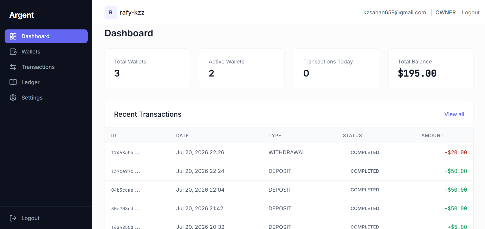
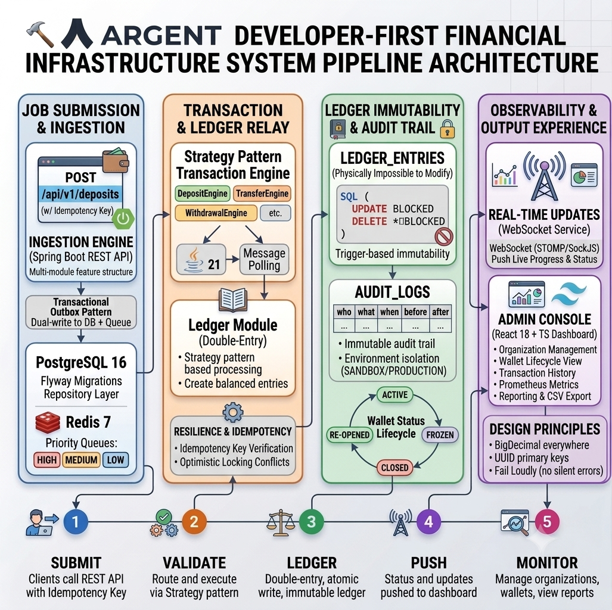
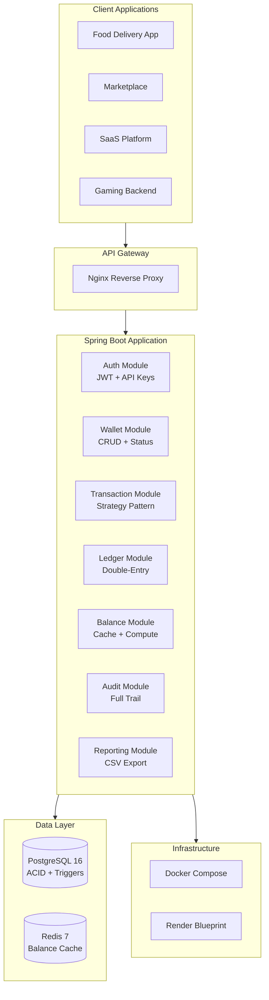
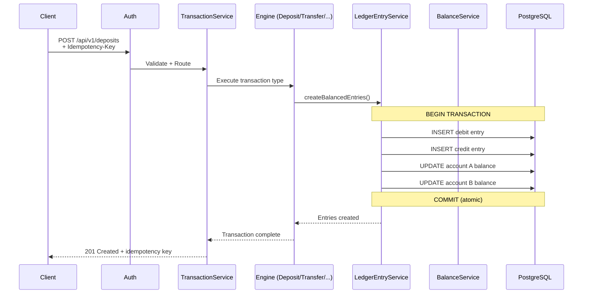
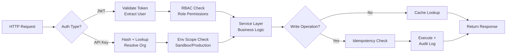
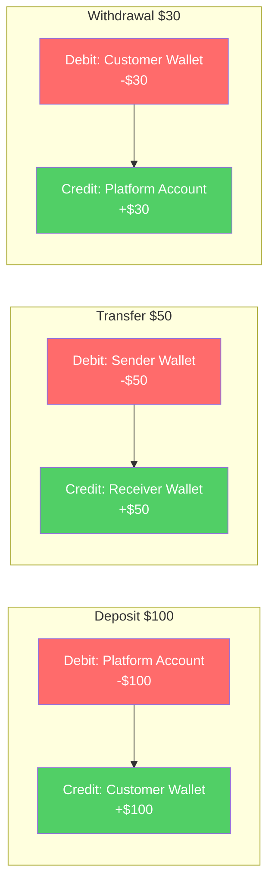
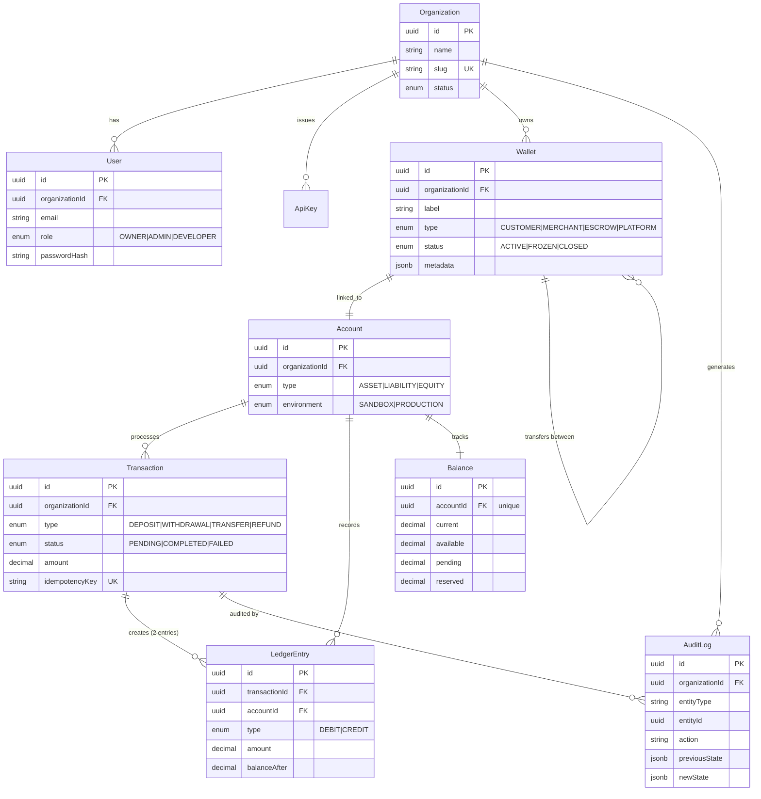

<div align="center">

# Argent

### Developer-First Financial Infrastructure

**The invisible accounting engine behind your product.**

Build wallets, credits, rewards, transfers, refunds, and balance management — without ever writing a ledger.

[](https://openjdk.org/projects/jdk/21/)
[](https://spring.io/projects/spring-boot)
[](https://www.postgresql.org/)
[](https://redis.io/)
[](https://react.dev/)
[](https://www.typescriptlang.org/)
[](https://www.docker.com/)
[](#testing)

<br />

<a href="#quick-start">Quick Start</a> · <a href="#architecture">Architecture</a> · <a href="#api-examples">API Examples</a> · <a href="#data-model">Data Model</a> · <a href="#deployment">Deployment</a>

<br />



</div>

---

## What Argent Solves

Every startup eventually builds the same financial primitives: wallets, credits, loyalty points, refunds, transfers, merchant balances. And every team discovers the same bugs: incorrect balances, race conditions, missing audit trails, duplicated transactions, and reconciliation nightmares.

**Argent eliminates this.** It provides double-entry bookkeeping, immutable ledger entries, and balance management behind a simple REST API — so developers can focus on their product, not their books.

```
Your App ──── REST API ──── Argent ──── Double-Entry Ledger
                                   ──── Immutable Audit Trail
                                   ──── Balance Management
                                   ──── Environment Isolation
```

---

## Architecture

### System Pipeline Achitecture



### System Overview



### Transaction Flow

Every transaction follows this atomic path through the system:



### Request Processing Pipeline



---

## Why Argent?

### Double-Entry Bookkeeping

Every transaction creates **two** ledger entries (debit + credit) that always balance. If the sum of debits != sum of credits, the transaction is rejected. Period.



### Immutable Ledger

Ledger entries are **physically impossible to modify** at the database level. PostgreSQL `BEFORE UPDATE` and `BEFORE DELETE` triggers raise exceptions if any mutation is attempted — even direct SQL cannot alter them.

```sql
-- This will FAIL at the database level:
UPDATE ledger_entries SET amount = 999 WHERE id = '...';
-- Error: ledger_entries are immutable

DELETE FROM ledger_entries WHERE id = '...';
-- Error: ledger_entries are immutable
```

### Strategy Pattern Transaction Engine

Each transaction type is an independent engine class with its own business logic:

```
TransactionService
    ├── DepositEngine     (funds in)
    ├── WithdrawalEngine  (funds out)
    ├── TransferEngine    (wallet-to-wallet)
    ├── RefundEngine      (reverse transaction)
    └── AdjustmentEngine  (manual correction)
```

Adding a new transaction type = adding one new engine class. Zero changes to existing code.

### Multi-Environment Isolation

API keys are scoped to `SANDBOX` or `PRODUCTION`. A sandbox key cannot touch production data. The environment chain flows:

```
Wallet(environment) → Account(inherits) → LedgerEntry(inherits)
```

Dashboard users (via JWT) see **all** environments — operators need full visibility, while client applications stay isolated.

---

## Data Model



---

## Tech Stack

| Layer | Technology | Why This |
|---|---|---|
| **Language** | Java 21 | Virtual threads, LTS, bulletproof BigDecimal handling |
| **Framework** | Spring Boot 3.4.1 | Industry standard for financial backends |
| **Database** | PostgreSQL 16 | ACID compliance, JSONB metadata, trigger-based immutability |
| **Cache** | Redis 7 | Sub-millisecond balance lookups with smart invalidation |
| **Frontend** | React 18 + TypeScript | Type-safe dashboard, Vite for speed |
| **Styling** | Tailwind CSS | Consistent design system, zero runtime overhead |
| **State** | Zustand + TanStack Query | Client state + server state separated cleanly |
| **Build** | Gradle (Kotlin DSL) | Multi-module support, faster builds than Maven |
| **Containerization** | Docker Compose | Reproducible local dev, one-command setup |
| **Deployment** | Render (Blueprint) | Free tier, auto-deploy from `render.yaml` |

---

## Quick Start

### Prerequisites

- Docker & Docker Compose
- Git

### One Command

```bash
git clone https://github.com/Abdul-Rafy2005/Argent.git && cd Argent && docker compose up --build
```

That's it. The entire stack boots in under 2 minutes:

| Service | URL | Purpose |
|---|---|---|
| **Frontend** | [localhost:3000](http://localhost:3000) | React Dashboard |
| **Backend API** | [localhost:8080](http://localhost:8080) | REST API |
| **Swagger UI** | [localhost:8080/swagger-ui.html](http://localhost:8080/swagger-ui.html) | API Explorer |
| **Health Check** | [localhost:8080/actuator/health](http://localhost:8080/actuator/health) | Service Status |

### Default Credentials

| Field | Value |
|---|---|
| Email | `admin@argent.com` |
| Password | `admin123` |

---

## API Examples

### Create a Wallet

```bash
curl -X POST http://localhost:8080/api/v1/wallets \
  -H "Authorization: Bearer <token>" \
  -H "Content-Type: application/json" \
  -d '{
    "label": "Main Wallet",
    "type": "CUSTOMER",
    "metadata": {
      "customerId": "cust_123",
      "email": "user@example.com"
    }
  }'
```

**Response:**
```json
{
  "success": true,
  "data": {
    "id": "550e8400-e29b-41d4-a716-446655440000",
    "label": "Main Wallet",
    "type": "CUSTOMER",
    "status": "ACTIVE",
    "environment": "SANDBOX",
    "balance": 0,
    "metadata": {
      "customerId": "cust_123",
      "email": "user@example.com"
    },
    "createdAt": "2026-07-21T22:00:00Z"
  }
}
```

### Deposit Funds

```bash
curl -X POST http://localhost:8080/api/v1/deposits \
  -H "X-Api-Key: <sandbox-key>" \
  -H "Idempotency-Key: dep_001" \
  -H "Content-Type: application/json" \
  -d '{
    "walletId": "550e8400-e29b-41d4-a716-446655440000",
    "amount": "100.00",
    "description": "Initial deposit",
    "reference": "order_789"
  }'
```

**Response:**
```json
{
  "success": true,
  "data": {
    "id": "txn_a1b2c3d4",
    "type": "DEPOSIT",
    "status": "COMPLETED",
    "amount": "100.00",
    "idempotencyKey": "dep_001",
    "ledgerEntries": [
      {
        "type": "DEBIT",
        "amount": "100.00",
        "accountType": "PLATFORM"
      },
      {
        "type": "CREDIT",
        "amount": "100.00",
        "accountType": "CUSTOMER"
      }
    ]
  }
}
```

### Transfer Between Wallets

```bash
curl -X POST http://localhost:8080/api/v1/transfers \
  -H "X-Api-Key: <sandbox-key>" \
  -H "Idempotency-Key: trf_001" \
  -H "Content-Type: application/json" \
  -d '{
    "sourceWalletId": "wallet_sender",
    "destinationWalletId": "wallet_receiver",
    "amount": "25.50",
    "description": "Payment for services"
  }'
```

### Query Ledger Entries

```bash
curl "http://localhost:8080/api/v1/ledger/entries?walletId=wallet_123&page=0&size=20" \
  -H "X-Api-Key: <sandbox-key>"
```

**Response:**
```json
{
  "success": true,
  "data": [
    {
      "id": "entry_001",
      "type": "DEBIT",
      "amount": "25.50",
      "balanceAfter": "74.50",
      "description": "Transfer to wallet_receiver",
      "createdAt": "2026-07-21T22:05:00Z"
    },
    {
      "id": "entry_002",
      "type": "CREDIT",
      "amount": "25.50",
      "balanceAfter": "125.50",
      "description": "Transfer from wallet_sender",
      "createdAt": "2026-07-21T22:05:00Z"
    }
  ],
  "meta": {
    "page": 0,
    "size": 20,
    "total": 2,
    "totalPages": 1
  }
}
```

### Get Balance

```bash
curl http://localhost:8080/api/v1/balances/wallet_123 \
  -H "X-Api-Key: <sandbox-key>"
```

```json
{
  "success": true,
  "data": {
    "walletId": "wallet_123",
    "current": "125.50",
    "available": "125.50",
    "pending": "0.00",
    "reserved": "0.00",
    "currency": "USD"
  }
}
```

### Generate CSV Export

```bash
curl "http://localhost:8080/api/v1/statements?walletId=wallet_123&from=2026-07-01&to=2026-07-31" \
  -H "X-Api-Key: <sandbox-key>" \
  -o statement.csv
```

---

## Project Structure

```
Argent/
├── backend/                              # Spring Boot application
│   ├── src/main/java/com/argent/
│   │   ├── common/                       # Shared utilities & config
│   │   │   ├── config/                   # Security, Redis, CORS, DataSource
│   │   │   ├── exception/                # Global exception hierarchy
│   │   │   └── response/                 # ApiResponse, PagedResponse
│   │   └── module/                       # Feature modules
│   │       ├── auth/                     # JWT + API Key authentication
│   │       ├── wallet/                   # Wallet CRUD & status management
│   │       ├── transaction/              # Transaction processing engine
│   │       │   └── engine/               # Strategy pattern engines
│   │       ├── ledger/                   # Double-entry ledger system
│   │       ├── balance/                  # Balance management & cache
│   │       ├── audit/                    # Full audit trail
│   │       └── reporting/                # Reports & CSV export
│   ├── src/main/resources/
│   │   └── db/migration/                 # 18 Flyway migrations (V1–V18)
│   └── src/test/                         # 190 tests (unit + integration)
│
├── frontend/                             # React dashboard
│   ├── src/
│   │   ├── pages/                        # Dashboard, Wallets, Transactions...
│   │   ├── components/                   # Reusable UI components
│   │   ├── api/                          # Axios client + interceptors
│   │   ├── store/                        # Zustand auth store
│   │   └── types/                        # TypeScript definitions
│   └── nginx.conf                        # Production reverse proxy
│
├── render.yaml                           # Render Blueprint (deploy config)
├── docker-compose.yml                    # Local development stack
└── Docs/                                 # Architecture, PRD, Rules, Memory
```

---

## Testing

### Test Coverage

| Category | Count | Framework |
|---|---|---|
| **Unit Tests** | ~128 | JUnit 5 + Mockito |
| **Integration Tests** | ~62 | JUnit 5 + Testcontainers |
| **Frontend Tests** | ~18 | Vitest + React Testing Library |
| **Total** | **190+** | |

### Key Test Scenarios

- **Ledger Immutability**: DB-level trigger rejection (UPDATE + DELETE both blocked)
- **Double-Entry Balance**: Every transaction produces balanced debit/credit pairs
- **Environment Scoping**: Sandbox key cannot access production data
- **Idempotency**: Duplicate requests return cached response (no double-charge)
- **Optimistic Locking**: Concurrent balance updates return 409 Conflict
- **Platform Wallet**: Lazy-created counterparty for deposits/withdrawals
- **Audit Trail**: Every write operation logged with before/after state

### Run Tests

```bash
# Backend (all 190 tests)
cd backend && ./gradlew test

# Frontend
cd frontend && npm test
```

---

## Environment Configuration

### Environment Variables

| Variable | Description | Default |
|---|---|---|
| `SPRING_PROFILES_ACTIVE` | Spring profile | `dev` |
| `DATABASE_URL` | PostgreSQL connection | `jdbc:postgresql://localhost:5432/argent_dev` |
| `SPRING_DATA_REDIS_HOST` | Redis host | `localhost` |
| `ARGENT_JWT_SECRET` | JWT signing secret | *(required)* |
| `ARGENT_CORS_ALLOWED_ORIGINS` | Allowed CORS origins | `http://localhost:3000` |
| `BACKEND_URL` | Backend URL for nginx proxy | `http://localhost:8080` |

### API Authentication

```
# Dashboard users (JWT)
Authorization: Bearer <access-token>

# Client applications (API Key)
X-Api-Key: <api-key>
```

---

## Deployment

### Render (Production)

The project includes a `render.yaml` Blueprint that provisions:

- **PostgreSQL 16** (free tier)
- **Redis 7** (free tier)
- **Backend** (Docker, Spring Boot)
- **Frontend** (Docker, React + Nginx)

```bash
# Deploy via Render Dashboard
# 1. Push to GitHub
# 2. Create Blueprint from render.yaml
# 3. Set ARGENT_CORS_ALLOWED_ORIGINS to your frontend URL
```

### Docker Compose (Local)

```bash
docker compose up --build -d
docker compose ps          # Verify all services running
docker compose logs -f     # Watch logs
docker compose down        # Stop everything
```

---

## Design Principles

| Principle | Implementation |
|---|---|
| **BigDecimal everywhere** | No `float` or `double` for financial data. Ever. |
| **UUID primary keys** | All entities use UUID. No auto-increment integers. |
| **Immutable ledger** | PostgreSQL triggers prevent any UPDATE or DELETE on `ledger_entries`. |
| **Idempotency required** | All write endpoints accept `Idempotency-Key` header. |
| **Environment isolation** | API keys scoped to SANDBOX or PRODUCTION. Cross-env = 403. |
| **Audit everything** | Every write operation logged with who, what, when, before, after. |
| **Fail loudly** | Optimistic locking failures → 409. Invalid states → 400. No silent errors. |

---

## Roadmap

### V1 (Current)
- [x] Multi-tenant organization management
- [x] JWT + API Key authentication with RBAC
- [x] Wallet CRUD with status lifecycle
- [x] Double-entry ledger with immutable entries
- [x] Transaction engine (Deposit, Withdrawal, Transfer, Refund, Adjustment)
- [x] Balance management with Redis caching
- [x] Full audit trail
- [x] Reporting & CSV export
- [x] React dashboard with 7 pages
- [x] Docker Compose local development
- [x] Render Blueprint deployment

### V2 (Planned)
- [ ] Webhook subscriptions for event notifications
- [ ] Reserved balances for hold/freeze scenarios
- [ ] Scheduled & recurring transfers
- [ ] Multi-currency support
- [ ] Rate limiting per API key
- [ ] Advanced analytics dashboard

### V3 (Future)
- [ ] Stripe / payment gateway integration
- [ ] SDKs (Java, Node.js, Python)
- [ ] AML/KYC compliance hooks
- [ ] Enterprise SSO & custom roles

---

## Contributing

1. Fork the repository
2. Create a feature branch (`git checkout -b feature/amazing`)
3. Commit your changes (`git commit -m 'Add amazing feature'`)
4. Push to the branch (`git push origin feature/amazing`)
5. Open a Pull Request

### Development Rules

- **No new dependencies** without discussion
- **Tests must pass** before merge
- **BigDecimal only** for financial amounts
- **UUID only** for primary keys
- **No secrets** in code or config files

---

## License

MIT License - see [LICENSE](LICENSE) for details.

---

<div align="center">

**Built with care by [Abdul-Rafy](https://github.com/Abdul-Rafy2005)**

*Financial infrastructure that developers can trust.*

</div>
